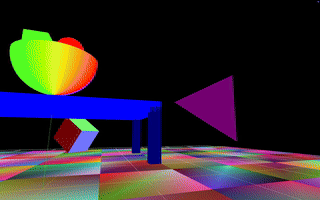

# 🎨 3D Graphics Demo

This project showcases a colorful 3D graphics rendering using custom shaders and geometry. The scene includes reflective surfaces, animated objects, and a dynamic camera perspective — all rendered in real-time.

## 📽️ Demo





## 🛠️ Technologies Used

- OpenGL 
- GLSL shaders
- Python 

## 🚀 Features

- Dynamic lighting and shading
- Smooth camera movement
- Real-time rendering
- Rainbow-colored materials

## 📁 Project Structure

```bash
.
├── shaders/        # Vertex and fragment shaders
├── models/         # 3D models used in the scene
├── textures/       # Texture maps and environment files
├── can.gif         # Demo animation
└── main.cpp        # Main rendering loop (or your entry point)
